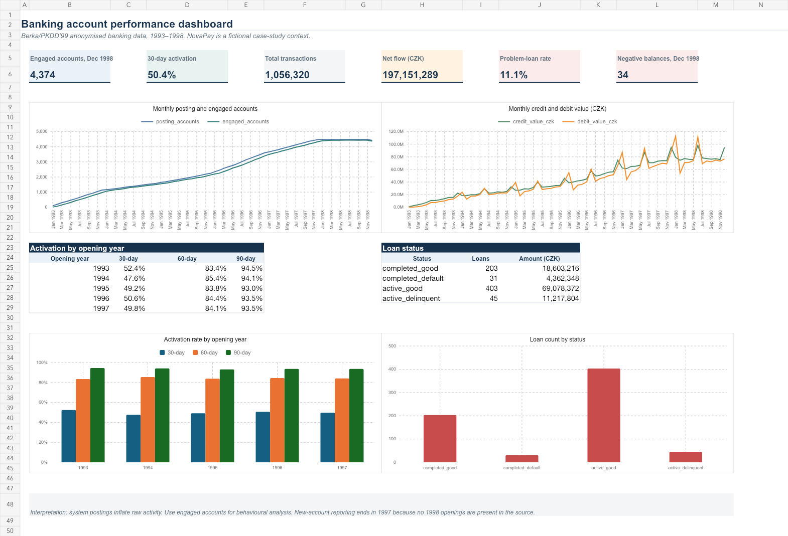
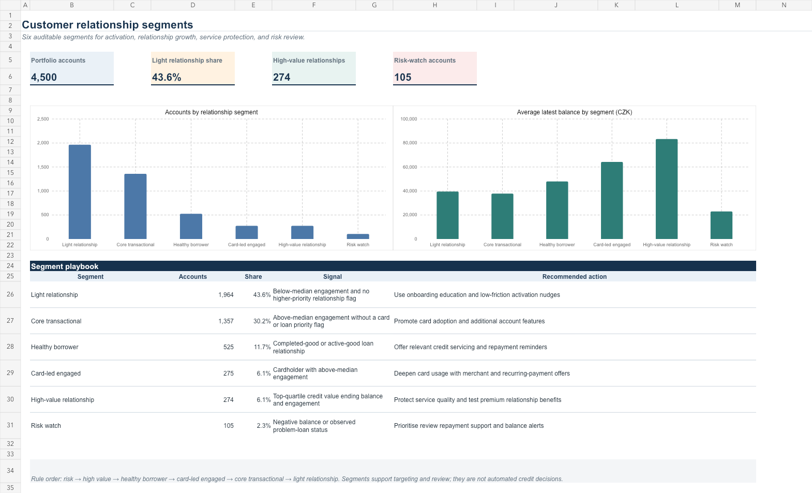
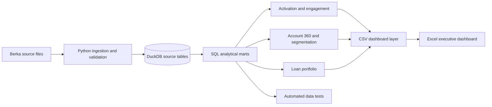

# NovaPay Banking Analytics

An end-to-end fintech analytics case study built on 1,056,320 anonymised bank transactions. It turns raw relational data into tested DuckDB models, behavioural customer segments, an executive Excel dashboard, and business recommendations.

> **Portfolio note:** NovaPay is a fictional case-study company. The underlying records are the historical Berka/PKDD'99 Financial Dataset, not data from a real modern fintech.

**[Open the interactive banking analytics cockpit](https://thvh2006.github.io/novapay-fintech-analytics/)** ·
[Executive decision memo](reports/03_executive_decision_memo.md) ·
[Download the Excel dashboard](dashboard/NovaPay_Banking_Analytics_Dashboard.xlsx)



## Business problem

The leadership team needs a reliable view of account growth, meaningful engagement, cash flow, and credit risk. Raw ledger activity cannot be used directly: opening deposits make first-day activation look like 100%, while automated fees and interest postings inflate monthly activity.

This project answers four questions:

1. How quickly do new accounts reach meaningful activity?
2. How has account engagement and transaction value changed over time?
3. Which relationship segments deserve activation, cross-sell, retention, or risk actions?
4. What limitations must decision-makers understand before acting?

## Results

| Finding | Result | Decision implication |
|---|---:|---|
| 30-day activation | 50.4% | Improve the first 30 days of onboarding; 60-day activation reaches 84.1% |
| Engaged accounts, Dec 1998 | 4,374 | Separate meaningful behaviour from all ledger postings |
| Net transaction flow | CZK 197.2M | Monitor as cash movement, not revenue or profit |
| Observed problem-loan rate | 11.1% | Maintain a dedicated review path for delinquent/defaulted loans |
| Light-relationship segment | 1,964 accounts (43.6%) | Prioritise activation education and low-friction engagement nudges |
| Risk-watch segment | 105 accounts (2.3%) | Review balances and repayment support before cross-selling |

## Customer segmentation

The segmentation is deterministic and mutually exclusive, making every account traceable to a business rule. Higher-priority risk and relationship conditions are evaluated before engagement tiers.

| Segment | Accounts | Share | Recommended action |
|---|---:|---:|---|
| Light relationship | 1,964 | 43.6% | Onboarding education and low-friction activation nudges |
| Core transactional | 1,357 | 30.2% | Promote card adoption and additional account features |
| Healthy borrower | 525 | 11.7% | Relevant credit servicing and repayment reminders |
| Card-led engaged | 275 | 6.1% | Merchant and recurring-payment offers |
| High-value relationship | 274 | 6.1% | Protect service quality and test premium benefits |
| Risk watch | 105 | 2.3% | Prioritise review, repayment support, and balance alerts |



The complete logic and validation are documented in [the segmentation report](reports/02_customer_segmentation.md).

## Analytical decisions

- **Activation:** first activity excluding `unspecified` system postings and the opening cash deposit.
- **Engaged account:** an account with a non-system, non-cash-deposit transaction in the month.
- **Cohort engagement:** exact-month behavioural activity. It is not labelled retention because it can rise again after inactivity.
- **Net flow:** credit value minus debit value. It is not revenue, profit, or a balance-sheet movement.
- **Observed problem loan:** source loan status `B` or `D`; this combines completed default and active delinquency.

## Architecture



## Repository structure

```text
dashboard/                 Excel dashboard and dashboard-ready CSV extracts
data/                      source instructions and local ignored data folders
docs/                      business context and metric/data dictionaries
reports/                   EDA notes, segmentation analysis, executive memo
sql/marts/                 account, activation, engagement, risk, and segment marts
src/ingestion/             raw-to-DuckDB and mart build pipelines
src/features/              reproducible dashboard exports
tests/                     source, grain, metric, and segmentation checks
```

## Reproduce the analysis

Requirements: Python 3.12 and [`uv`](https://docs.astral.sh/uv/).

```bash
uv sync
source .venv/bin/activate
python src/ingestion/build_berka_database.py
python src/ingestion/build_analytics_marts.py
python src/features/export_dashboard_data.py
pytest -q
ruff check .
```

Raw source files and the generated DuckDB database are ignored by Git. Follow [`data/README.md`](data/README.md) to obtain the public dataset.

## Deliverables

- `dashboard/NovaPay_Banking_Analytics_Dashboard.xlsx` — executive dashboard and supporting data tabs.
- `reports/01_eda_findings.md` — metric risks and exploratory findings.
- `reports/02_customer_segmentation.md` — methodology, validation, and segment actions.
- `reports/03_executive_decision_memo.md` — concise leadership recommendations.
- `docs/metric_dictionary.md` — auditable business definitions.

## Limitations

- The data covers 1993–1998 and demonstrates analytical method, not current fintech behaviour.
- No new account openings appear in 1998, so acquisition conclusions use 1993–1997.
- Ledger records do not include app sessions, marketing exposure, revenue, or experiment assignment.
- The segmentation is descriptive and action-oriented; it is not a causal model or credit decision system.
- Churn, fraud detection, and A/B testing are intentionally excluded because the source cannot support credible labels.

## Technology

Python · SQL · DuckDB · pytest · Ruff · Excel

## Data source

Berka / PKDD'99 Financial Dataset. Primary catalogue: [CTU Relational Dataset Repository](https://relational.fel.cvut.cz/dataset/Financial). See [`data/README.md`](data/README.md) for provenance and retrieval notes.
